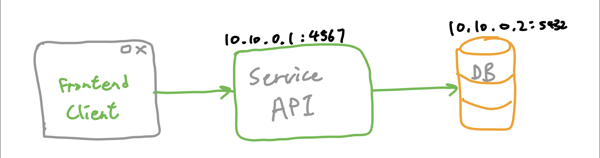
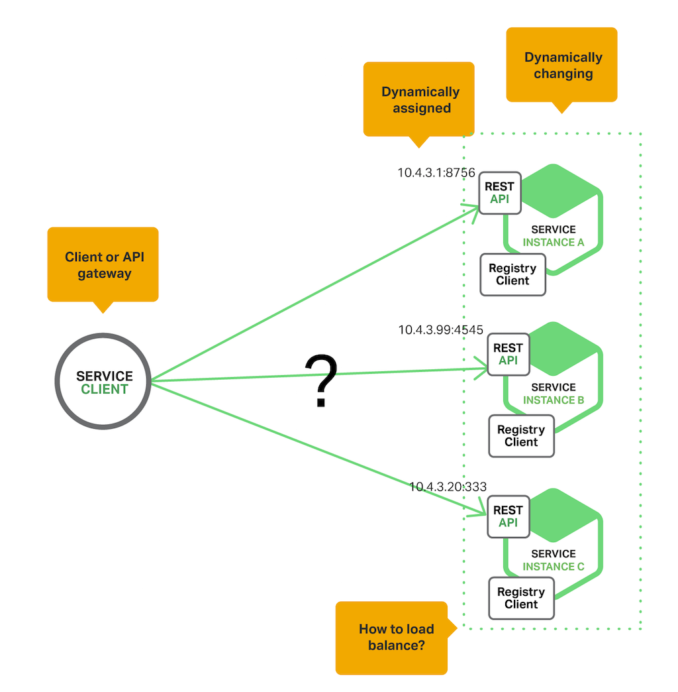

# Service API tutorial - Service Discovery

## Prerequisites

- Part 1, 2, 3 of the Service API tutorial series
- Redis installed locally
  - [https://redis.io/download](https://redis.io/download)
  - You can use `brew install redis` on Mac
- Latest version of [https://github.com/xumr0x/service-api-example](https://github.com/xumr0x/service-api-example)

## What is Service Discovery?

In the previous parts we created a frontend webpage that display/modify data by communicating with a backend service. But how does the frontend know where and which backend service to reach out to? How does two services connect with each other?

The simplest way to connect each services is to give them each IP addresses of each other. For instance, the frontend is given the address of the backend, and the backend is given the address of the database.

Like this:



However, this structure raises a couple questions:
- What happens if we want more than 1 frontend and 1 backend services? How do we connect them together then?
- What happens if we one of the backend services is down and we need to redeploy it, do we have to change the address in all our frontend code as well?

Moreover as we scale, we want to be able to add and remove services dynamically depending on the load. For instance, we want to have 3 backend services and 2 frontend services at peak traffic, and only 1 frontend and backend services at normal load. This raises another question:
- How do we balance traffic between services so that they receive a equal amount of work?



This is where Service Discovery comes in. Service Discovery allows services to determine locations of other available service instances and load balancing requests across them. 

When a client needs to talk to a service, it first queries a service registry, which is a database of available service instances. The client then uses a load‑balancing algorithm to select one of the available service instances and makes a request.


## Introduction

In this part we will be building a Client-side service discovery structure using Redis as the service registry.

## Step 1 - Setting up Redis on DO

Create a droplet on DigitalOcean (1gb should be good enough) using the Ubuntu 18.04 image with private networking enabled.

Follow [this tutorial](https://www.digitalocean.com/community/tutorials/how-to-install-and-secure-redis-on-ubuntu-18-04) to install redis on the droplet.

## Step 2 - Create a registry client

*Navigate to `registry-client/client.rb`.*

There are two core functions as a registry client:
- Register itself to the service registry when the service is up.
- Query the registry for addresses of services that it wants to talk to.

### Register()

Register() registers itself to the Service Registry. This method does 2 things:
- First, it registers itself to the corresponding service set via `SADD serviceName "address"`. A service set is a set of addresses of instances running the service. Then, it registers itself by setting its status to "alive" that expires every 30 seconds via `SET address "alive" EX 30`. **Note: these two steps are wrapped in a [Transaction](https://redis.io/topics/transactions) to ensure data consistency.**
- Second, it needs to re-register itself every 30 seconds via `SET ...` (in the background) to the registry to *prove* that this service is still alive. If the registry does not hear back from this service within this time period, it will be declared *dead*.

This is what happens in Redis,

```
# An instance running Service A registers itself.
SADD serviceA "10.10.10.11:4567"
SET 10.10.10.11:4567 "alive" EX 30 

# Another instance running Service A registers itself.
SADD serviceA "45.21.34.12:4567"
SET 45.21.34.12:4567 "alive" EX 30

# Every 30 seconds...
SET 10.10.10.11:4567 "alive" EX 30
SET 45.21.34.12:4567 "alive" EX 30
SET 10.10.10.11:4567 "alive" EX 30
SET 45.21.34.12:4567 "alive" EX 30
...
```

### Service()

Service() returns the address of an instance running a given service. Internally, the client first asks for the list of instances running a particular service. Then, it picks one of the instances (ip addresses) using a load balancing strategy. Before returning the address, it checks if the address is still *alive* via `EXISTS ...`. If it is alive, return the address. Otherwise, picks another address.

This is what happens in Redis,

```
# Lookup instances running serviceA.
SMEMBERS serviceA
1) "10.10.10.3:4567"
2) "10.10.10.1:4567"
3) "10.10.10.2:4567"

# Pick an instance and checks if it is alive.
EXISTS 10.10.10.1:4567
(integer) 1   # it is alive!!
```

As for the load balancing strategy, feel free to implement any one you want: [resource](https://www.nginx.com/resources/glossary/load-balancing/)

Extra: Retry Mechanism

Have you ever wondered what will happen when the service set is empty? i.e `SMEMBERS serviceB returns (empty list or set)` How do you handle this situation?

Well, you have two options. Option 1, you can fail the request immediately, meaning you can't find any suitable service instances. But this is not good, what if a service instance comes back online right after you failed to request? If you waited *one more second* you could have returned successfully.

Option 2, retry immediately if you can't find any suitable service instances. But this is also *no bueno*. Why? Because how do you know how long you have to retry for? And how frequently should you retry (you don't want to DDOS our service registry)?

Turns out this is very common problem in designing a distributed system. Here are some proposed solutions, they all have some pros and cons:
- [Exponential Backoff](https://en.wikipedia.org/wiki/Exponential_backoff)
- [Circuit Breaker](https://martinfowler.com/bliki/CircuitBreaker.html)
- [Azure's retry best practice](https://docs.microsoft.com/en-us/azure/architecture/best-practices/transient-faults)

You need to implement one of the above strategies or create your own retry mechanism. Hint: use [Ruby's `retry`](https://ruby-doc.org/docs/keywords/1.9/Object.html#method-i-retry) for ease.

## Step 3 - Integrate to existing services

Now that you have a working registry client, it is time to put it to use.

- Replace all environment variables lookups with `client.service(...)`
  - For instance: `client.service('backend-service')` will return `10.10.10.3:4567`
- Register itself on every service with `client.register(...)`
  - For instance: `client.register('backend-service', '10.10.10.3', 4567)`
  - Hint: ruby's [Socket](https://ruby-doc.org/stdlib-2.5.3/libdoc/socket/rdoc/Socket.html#method-c-ip_address_list)
- Modify `rails.service` unit file in your two droplets to match the new changes
  - For instance:
    ```
    [Unit]
    Description=FrontendApp
    Requires=network.target

    [Service]
    Type=simple
    User=rails
    Group=rails
    WorkingDirectory=/home/rails/service-api-example/frontend-sinatra
    ExecStart=/bin/bash -lc 'bundle exec puma'
    TimeoutSec=30s
    RestartSec=30s
    Restart=always
    Environment=REGISTRY_HOST=10.10.10.1
    Environment=REGISTRY_PORT=6379
    Environment=REGISTRY_PASSWORD=iloveredis

    [Install]
    WantedBy=multi-user.target
    ```

### **Now your cloud architecture is running with service discovery!!** 🎉