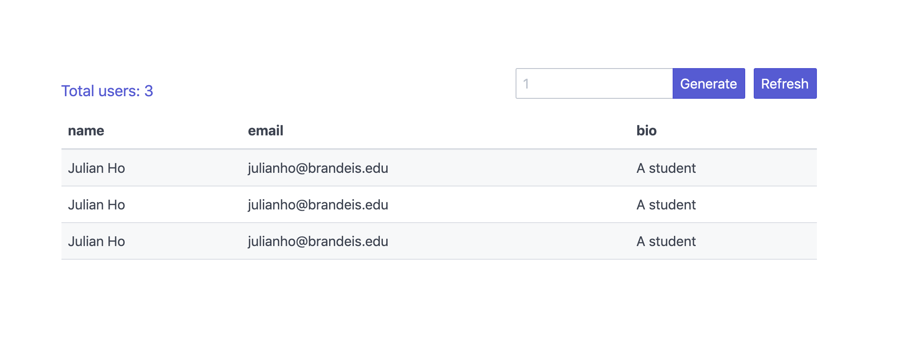

# Service API tutorial 

In this tutorial, we will create a multi-server architecture for making a simple app for creating and retrieving a list of users from the database!

## Start here

### [Part 1 - Setting up your cloud architecture](docs/cloud.md)

### [Part 2 - Setting up your Sinatra app](docs/sinatra.md)

### [Part 3 - Setting up CI/CD](docs/cicd.md)

## Flow

## Architecture

- Sinatra Frontend (1 Droplet)
  - Responsible for asking the Service API for the list of users, and render a html page for it.
- Sinatra Service API (1 Droplet)
  - Responsible for talking to Postgres and retrieving Users' information.
- Postgres DB (1 Database)
